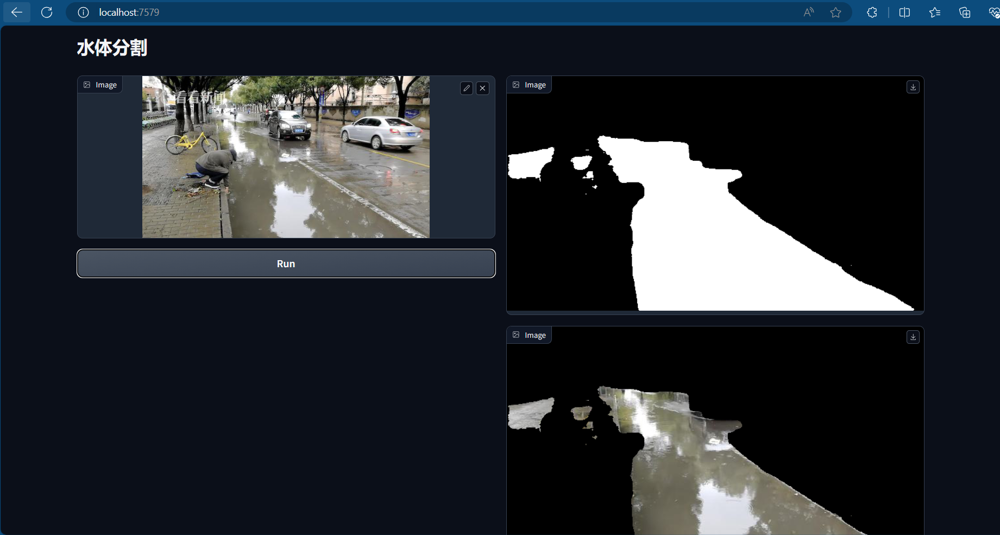

# **环境配置**

创建环境

```bash
conda create -n samwater python==3.8
```

激活环境

```bash
conda activate samwater
```

安装pytorch

```bash
pip install torch==1.12.1+cu113 torchvision==0.13.1+cu113 torchaudio==0.12.1 --extra-index-url https://download.pytorch.org/whl/cu113
```
安装相关环境

```bash
pip install -U openmim
```

```bash
mim install mmcv-full==1.6.1
```

```bash
mim install mmsegmentation==0.27.0
```

克隆仓库

```bash
git clone https://github.com/DaoCaoRenH/samwater.git
```

```bash
cd samwater
```

```bash
pip install -r requirements.txt
```

# **测试**

在configs/data-sam-vit-t.yaml中修改测试数据集路径

第34行root_path_1: data/val/img, data/val/img为测试图片所在文件夹的路径, 可以根据实际数据集路径修改。该文件夹下只能存放图片。

第35行root_path_2: data/val/label, data/val/label为测试图片对应标签所在文件夹的路径, 可以根据实际数据集路径修改。该文件夹下只能存放图片。

测试命令：在当前目录下执行 --config后是配置文件路径 --model后是权重文件路径

```bash
python test.py --config configs/data-sam-vit-t.yaml --model model.pth
```


# **可视化**

在当前环境安装依赖库

```bash
pip install gradio==3.45.2
```

在当前项目路径下运行命令

```bash
python app.py
```

打开http://0.0.0.0:7579 ,可视化界面如下图



